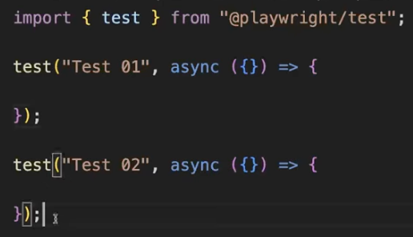
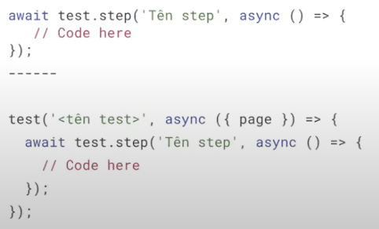
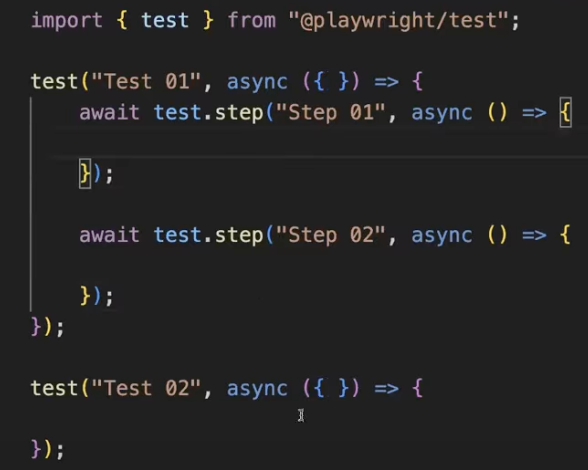
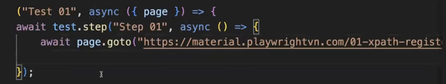
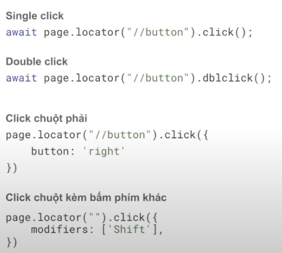
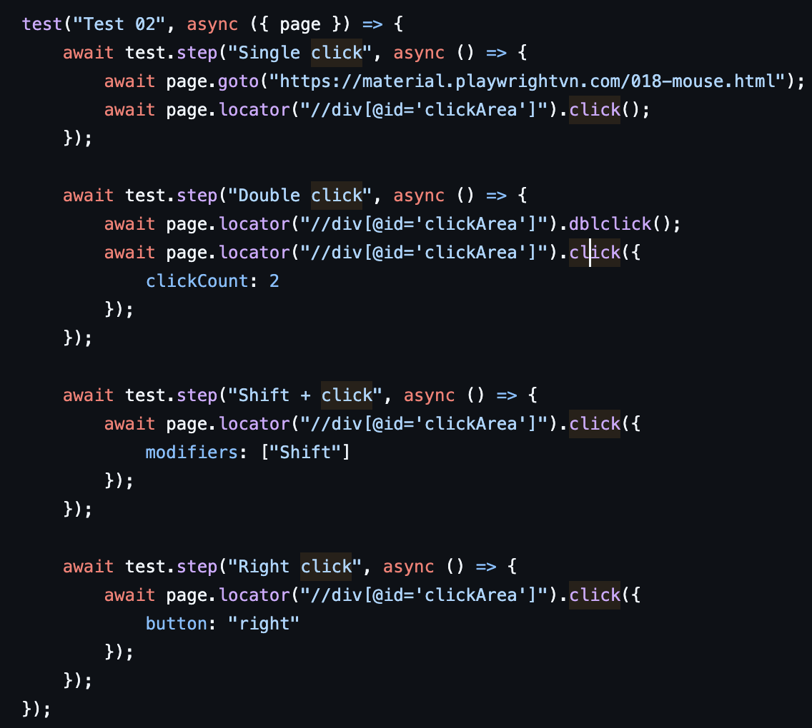
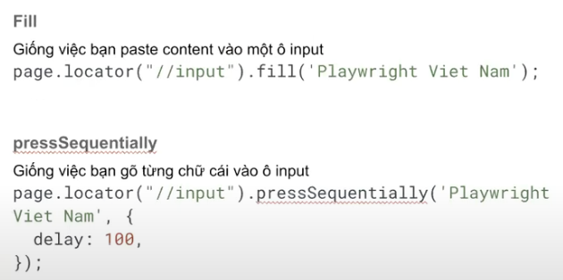
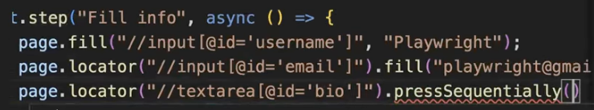
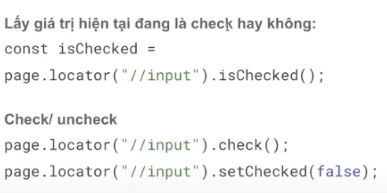
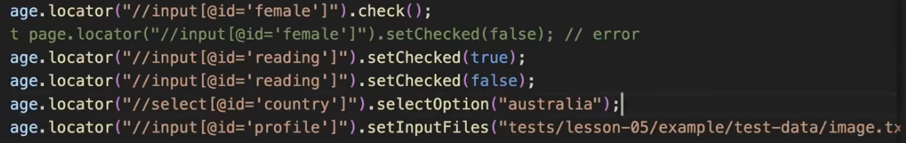

1. Js advanced

1.1 Lamda function: su dung dau => thay vi tu khoa function
cu phap
(parameter) => {
// code here
}
ex: const add = (a, b) => {
return a + b;
}
console.log(add(2, 2));

1.2 Anonymout function: ham ko co ten, su dung 1 lan hoac lam doi so truyen vao ham khac
cu phap
function(parameter) {
// code here
}
ex:
let greet = function () {
console.log("K16 Playwright")
}
greet();

2. DOM: Document Object Model
   trong DOM co cac the (the mo, thuoc tinh, gia tri cua thuoc tinh, text, the dong)

- 
: chia khoi
- <h1></h1> den <h6>: tao header phan cap theo thu tu
- <form>: chua form thong tin
- input: text, email, radio, checkbox, file, color, range, date
- textare: field input dang to
- radio button: nut chon 1 lua chon
- checkbox: nut chon nhieu lua chon
- list va dropdown: show danh sach hoac menu dropdown
- button: tao nut bam
- table: show bang data
  -- thead = table heading
  --- tr = table row = 1 dong
  ---- th = table heading: text in dam
  -- tbody
  ---tr = table data
- date picker: bo chon ngay
- slider: thanh truot
- iframe: show noi dung tu 1 trang web khac ben trong trang hien tai

3. Selector:
   Co nhieu kieu: XPath, CSS, Playwright

- XPath = XML Path
- Co 2 loai

* Tuyet doi: di doc theo cay DOM, bat dau boi 1 /
* Tuong doi: dua vao dac tinh, bat dau boi 2 //
  cu phap: //tenthe[@thuoctinh="giatri"]

4. Playwright basic syntax

- test: don vi co ban de khai bao
  cu phap:
  import { test } from '@playwright/test';

test ('<ten test>', async ({page}) => {
// code cua test
});

- step: don vi nho hon test, de khai bao tung step cua test case, step ne dc map 1-1 vs test case de de dang maaintain
  
  

- basic navigation

* navigate: await page.togo('https://...');
  

* click: co nhieu loai click nhu sau: Single click, double click, click chuot phai, click chuot kem bam phim khac
  
  

* input: co 2 loai: fill (nhu paste content vao o input) va pressSequentially (nhu go tung chu vao o input)
  
  

* radio/checkbox
* select option
* set input file
  
  
